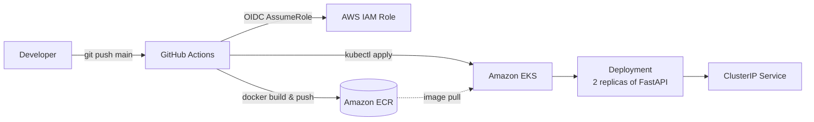

# fastapi-eks-demo

A small Python FastAPI microservice with `/health`, packaged in a multi-stage
Docker image, deployed to AWS EKS via GitHub Actions, with infrastructure
provisioned by modular Terraform.

## Architecture



## Repository layout

```
.
├── app/                          # FastAPI source
│   ├── main.py                   # /health and / endpoints
│   ├── requirements.txt
│   └── tests/test_health.py
├── Dockerfile                    # multi-stage, non-root, python:3.12-slim
├── .dockerignore
├── k8s/
│   ├── deployment.yaml           # 2 replicas, readiness/liveness, resource limits
│   ├── service.yaml              # ClusterIP
│   ├── configmap.yaml            # APP_ENV, LOG_LEVEL
│   └── secret.yaml               # placeholder; CI overwrites with real value
├── terraform/
│   ├── bootstrap/                # one-time S3 state bucket + DynamoDB lock
│   ├── modules/
│   │   ├── vpc/                  # VPC + 2 public + 2 private subnets + NAT
│   │   ├── eks/                  # EKS cluster + managed node group + OIDC
│   │   ├── ecr/                  # ECR repo with lifecycle + scan-on-push
│   │   └── iam/                  # GitHub Actions OIDC role + permissions
│   ├── envs/dev/                 # composes modules; S3 remote state
│   └── README.md
├── scripts/bootstrap.sh          # one-shot bootstrap + apply
├── .github/workflows/ci-cd.yml   # test -> build/push -> deploy
├── BREAK_ME.md                   # debugging exercises
└── README.md
```

## Prerequisites

- AWS account with admin credentials
- `terraform` >= 1.5
- `aws` CLI v2
- `kubectl` >= 1.34
- `docker` (for local build/test)
- A GitHub repository (push this code there once provisioned)

## End-to-end setup

### 1. Provision infrastructure

```bash

./scripts/bootstrap.sh
```

The script:

1. Applies `terraform/bootstrap/` to create the S3 state bucket and DynamoDB
   lock table (uses local state for this step only).
2. Applies `terraform/envs/dev/` (which uses S3 remote state) to create the VPC,
   EKS cluster, ECR repository, and the IAM role assumable by GitHub Actions
   via OIDC.
3. Prints the values to paste into the GitHub repo settings.

### 2. Configure GitHub repo

In `Settings -> Secrets and variables -> Actions -> Secrets`, add:

| Name | Source |
|---|---|
| `AWS_ROLE_ARN` | `terraform output -raw github_actions_role_arn` |
| `AWS_REGION` | `us-east-1` (or `terraform output -raw region`) |
| `ECR_REPOSITORY` | `terraform output -raw ecr_repository_url` |
| `EKS_CLUSTER_NAME` | `terraform output -raw cluster_name` |
| `API_KEY` | Any string. Will be injected into the app via Secret. |

### 3. Push to `main`

```bash
git remote add origin git@github.com:bilalmushtaq514/fastapi-eks-demo.git
git push -u origin main
```

This triggers the `ci-cd` workflow, which:

1. Runs `pytest` against the FastAPI app.
2. Assumes the AWS role via OIDC (no static keys).
3. Builds the multi-stage Docker image and pushes `:<sha>` and `:latest` to ECR.
4. Updates kubeconfig for the EKS cluster.
5. Applies `ConfigMap`, recreates `Secret` from the GH secret, and applies
   `Deployment` (with the image tag substituted) and `Service`.
6. Waits for the rollout to complete.

## Verifying the deployment

```bash
aws eks update-kubeconfig --name microservice-dev --region us-east-1

kubectl get pods -l app=microservice -o wide   # expect 2/2 Running
kubectl get svc microservice                   # ClusterIP

# Probe the API
kubectl port-forward svc/microservice 8080:80
curl localhost:8080/health
# {"status":"ok","env":"dev","log_level":"info","api_key_loaded":true}
```

## Local development

```bash
cd app
pip install -r requirements.txt pytest httpx
pytest -q
uvicorn app.main:app --reload
```

Build & run the container locally:

```bash
docker build -t microservice:local .
docker run --rm -p 8000:8000 \
  -e APP_ENV=local -e LOG_LEVEL=debug -e API_KEY=secret \
  microservice:local
curl localhost:8000/health
```

## Tear down

EKS dev runs ~$75/month idle. To stop the bill:

```bash
cd terraform/envs/dev
terraform destroy

# Optionally also remove the state backend:
cd ../../bootstrap
terraform destroy
```

## Notes & decisions

- **Modular Terraform**: each AWS service (VPC, EKS, ECR, IAM) is its own
  module under `terraform/modules/`, composed by `terraform/envs/dev/`.
  Adding a `prod` env is just another folder under `envs/`.
- **Remote state**: S3 + DynamoDB lock; bootstrapped by a separate
  Terraform configuration with local state.
- **OIDC over static keys**: GitHub Actions assume an AWS IAM role via
  OpenID Connect — no long-lived access keys stored in GitHub secrets.
- **Authorization to EKS**: the GitHub Actions IAM role is granted
  `AmazonEKSClusterAdminPolicy` via an EKS access entry, so `kubectl` works
  without separate `aws-auth` ConfigMap edits.
- **Secret hygiene**: the committed `k8s/secret.yaml` is a placeholder.
  CI recreates the `Secret` at deploy time from the `API_KEY` GitHub secret
  using `kubectl create secret --dry-run=client -o yaml | kubectl apply -f -`,
  so no real secret is ever stored in the repo.
